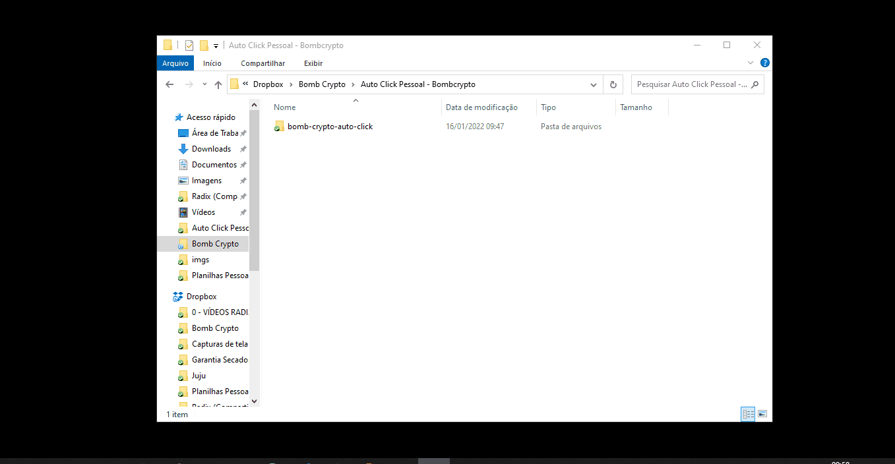

# Autoclick para Bombcrypto

Script, desenvolvido em python, utilizado para coordenar cliques do mouse de acordo com um período de tempo configurável pelo usuário, para otimizar o farm no game bombcrypto.

## Pré-requisitos para rodar o script

1) Download do python no site oficial: https://www.python.org/

2) Instalação do python conforme imagem a seguir:

3) Verificação da instalação correta do python:
  - Abrir o terminal do windows **(Windows + R -> digitar "CMD" -> OK)**
  
  
  
  - Digitar o comando: **python --version** 
   
  - Deverá aparecer a versão do python instalada **(Versão 3.x.x)**
  

4) Download dos arquivos do script:
  - Acessar o link do repositório: https://github.com/RodrigoCezarLeao/bomb-crypto-auto-click
  - Baixar arquivos zipados do repositório: 
  - Extrair arquivos e colocar em sua pasta de preferências (Ex: Documentos, Área de Trabalho, C:/, etc.)

5) Instalar requirements do python:
  - Navegar até a pasta onde os arquivos baixados e extraídos foram colocados e abrir o **promt de comando (cmd)** nessa pasta, conforme gif a seguir:  
  
  
  - Digitar o comando: **pip install -r requirements.txt**
  
  
## Rodar o script

1) Navegar até a pasta onde os arquivos foram baixados e extraídos
2) Abrir o promt de comando (cmd) nessa pasta
3) Digitar o comando: **python script.py**
4) Deixar a aba do jogo aberta **(com o jogo já logado)**
5) Observar os logs aparecendo no terminal (duração das execuções de trabalho e descanso dos heróis)
  
  
  
